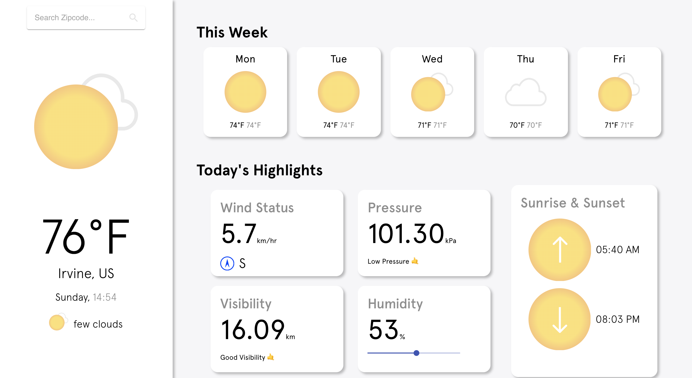

# Kota Weather Application

kotaweather.herokuapp.com is a simple weather application that uses OpenWeatherMap API to fetch weather data based on geolocation and zipcodes in the United States. 

  

## How it was made

- React.js
- Node.js
- Express
- React Hooks
- OpenWeatherMap API
- material-ui

## What I learned

While creating this project, I learned how to make simple API endpoints to connect the backend node/express package with a React.js front-end. I learned more about asynchronous function calls in order to fetch data dynamically when searching different zipcodes. 